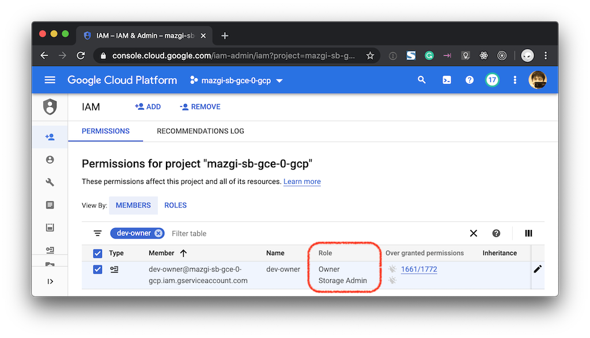
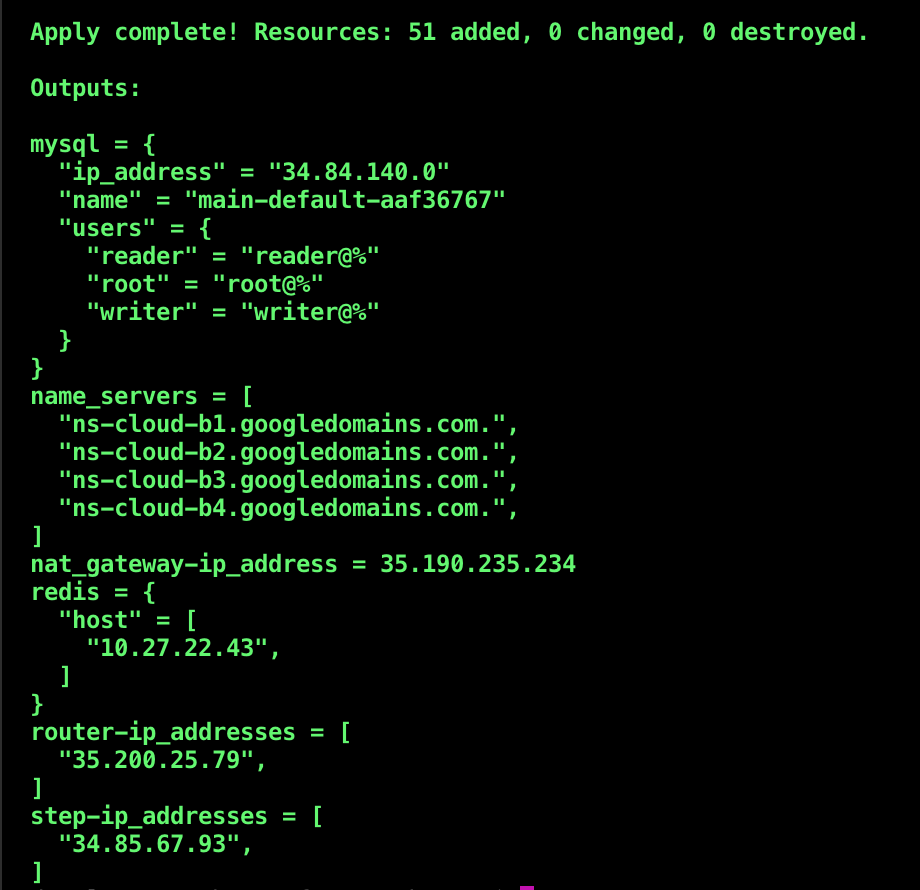

# Google Compute Engine Web App Environment

## What is this?

This repository is a provisioning example of the GCP to serve a traditional Web Application.

## Prepare

**1. Create Google Cloud service account and generate the key**

You need a Google Cloud service account that has roles as below.

- `Owner`
- `Storage Admin`

If you don't have any service account, you should create a new one.  
If your service account has not the above roles, you should add the roles.



Place GCP service account key as a JSON formatted file at `config/credentials/google-cloud-keyfile.json`.

If you use [1Password](https://1password.com/downloads/command-line/), you can get the file like below command.

```shellsession
op get document YOUR-DOCUMENT-NAME > config/credentials/google-cloud-keyfile.json
```

To get more information about Google Cloud service account and service account key, see:

- [Creating and managing service accounts](https://cloud.google.com/iam/docs/creating-managing-service-accounts)
- [Creating and managing service account keys](https://cloud.google.com/iam/docs/creating-managing-service-account-keys)

**2. Create .env file**

Create a text file as named `.env` like below.

```
# UID=1000 # only needs on Linux/UNIX
# GID=100 # only needs on Linux/UNIX
CLOUDSDK_CORE_PROJECT=YOUR-GCP-PROJECT-NAME
TF_VAR_gcp_project_id=YOUR-GCP-PROJECT-NAME
PROJECT_UNIQUE_ID=YOUR-UNIQUE-STRING
TF_VAR_project_unique_id=YOUR-UNIQUE-STRING
TF_VAR_basename=YOUR-STRING-FOR-PREFIX
TF_VAR_basedomain=your-delegatable-domain.example.com
TF_VAR_ip_cidr_range=10.0.0.0/24
TF_VAR_cidr_blocks_allow_http=["0.0.0.0/0"]
TF_VAR_cidr_blocks_allow_http_restricted=["0.0.0.0/0"]
TF_VAR_cidr_blocks_allow_ssh=["0.0.0.0/0"]
TF_VAR_cloud_sql_root_password=A-PASSWORD-YOU-DECIDED
TF_VAR_cloud_sql_reader_password=A-PASSWORD-YOU-DECIDED
TF_VAR_cloud_sql_writer_password=A-PASSWORD-YOU-DECIDED
TF_VAR_github_accounts_for_ssh=["your-github-account-name"]
```

**3. Place user SSH public keys**

Download user SSH public keys from GitHub like below commands.  
The public keys are used for SSH login to the step servers.

```shellsession
mkdir -p tmp/users-keys/mazgi
curl -L github.com/mazgi.keys > tmp/users-keys/mazgi/pubkeys.txt
```

## Provisioning

```shellsession
docker-compose up provisioning
```

```shellsession
docker-compose run provisioning terraform apply
```

You get outputs like below if your terraform apply command succeeded.  
You should delegate the sub-domain with `name_servers` values you get.



## Links

- https://console.cloud.google.com/net-services/loadbalancing/advanced/sslCertificates/list
- https://cloud.google.com/sql/docs/mysql/connect-admin-ip#connect-ssl
