# How to check the provisioned environment

### SSH

**Login to step via GCP web console**

Click the `SSH` button for your step instance on [VM instances view on the GCP web console](https://console.cloud.google.com/compute/instances).

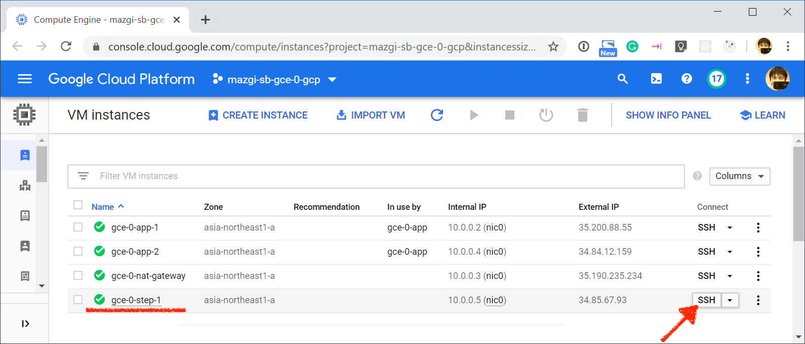
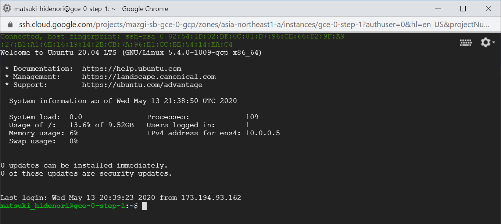

**SSH login to step from your local PC**

Check the DNS resolution for the step instances you created.  
And check the connectivity in the TCP/IP layer to the step from your local PC.

```shellsession
export $(<.env)
dig +short A step-1.${TF_VAR_basename}.${TF_VAR_basedomain}
nc -zv step-1.${TF_VAR_basename}.${TF_VAR_basedomain} 22
```

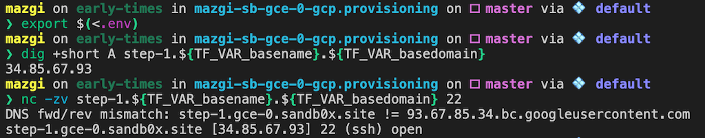

Log in your step instance via SSH with your GitHub account name and private key from your local PC.

```shellsession
ssh step-1.${TF_VAR_basename}.${TF_VAR_basedomain}
```

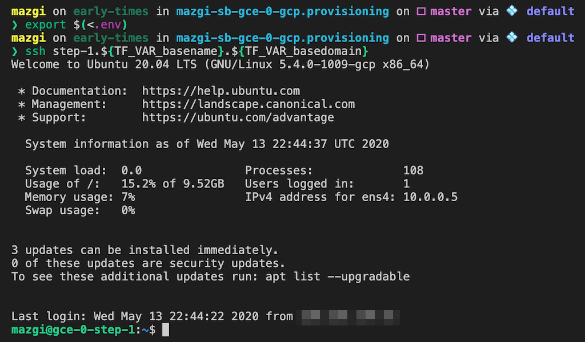

**SSH login to app from step**

Check the connectivity in the TCP/IP layer to the app from your step.

```shellsession
nc -zv YOUR-APP-INSTANCE-NAME 22
```

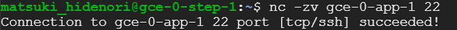

Log in your app instances via SSH as `root` user from your step instances.

```shellsession
sudo ssh YOUR-APP-INSTANCE-NAME
```

**NOTE:** You should run the ssh command as `root` on the step because the private key placed in the `/root/.ssh` directory in the step.  
If you used the `ssh -l root` command as a non-root user, you can't log in to the app.

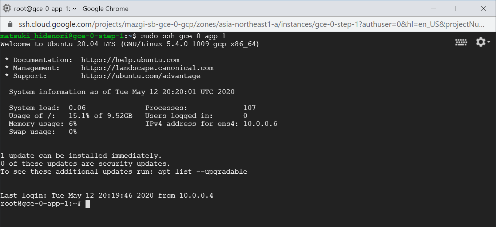

**SSH login to nat-gateway from step**

Get your `gcloud` command snippet for connecting nat-gateway you created from [VM instances view on the GCP web console](https://console.cloud.google.com/compute/instances).

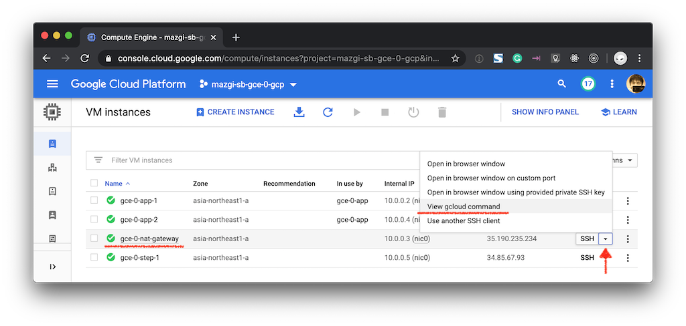
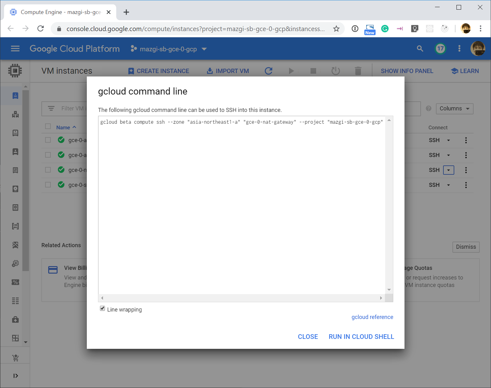

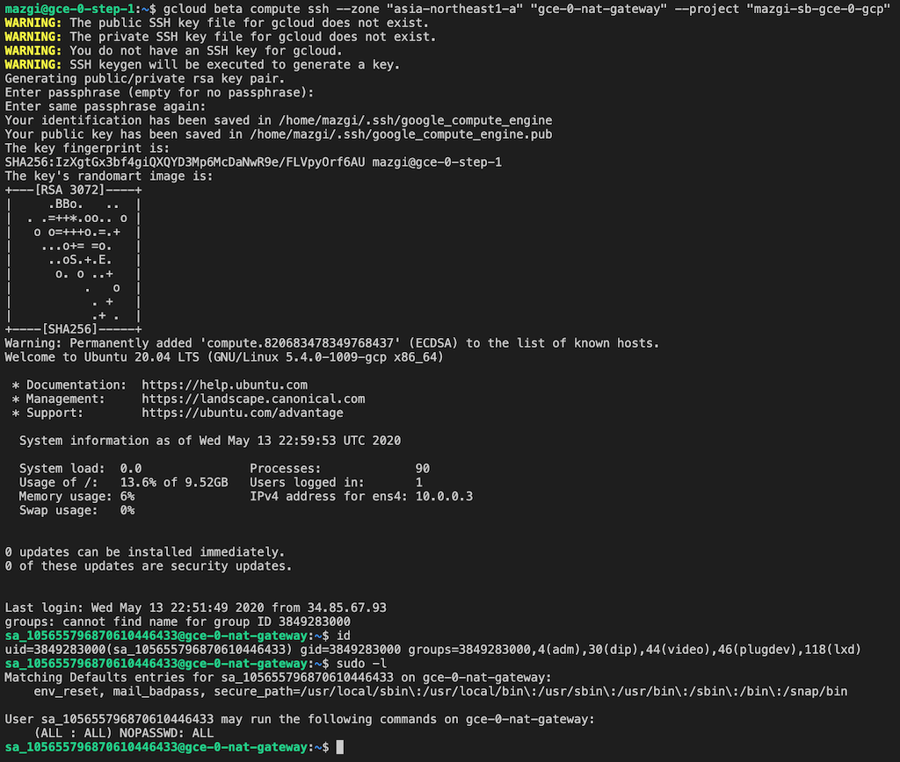

### HTTP/HTTPS

**HTTP Access via Load Balancer**

```shellsession
export $(<.env)
curl -LI "${TF_VAR_basename}.${TF_VAR_basedomain}" -s -o /dev/null -w '%{http_code}\n'
```

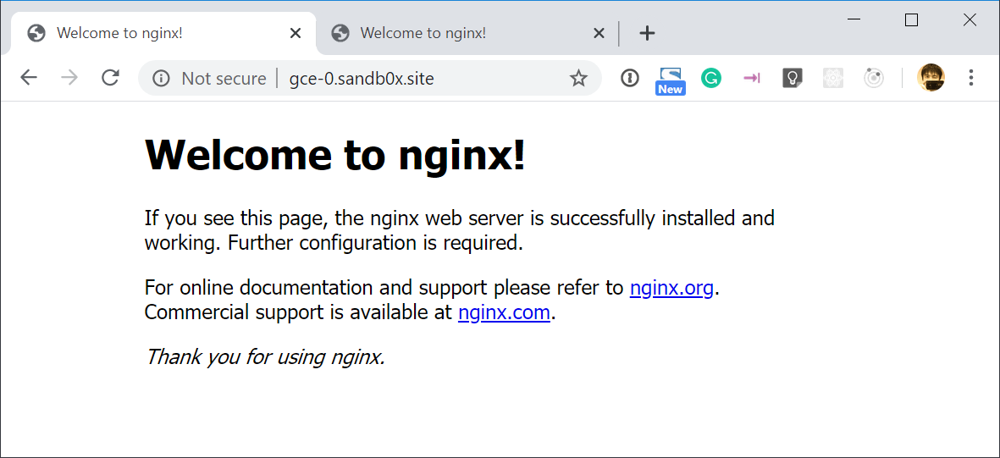

**HTTPS Access via Load Balancer**

```shellsession
gcloud compute ssl-certificates list
```

```shellsession
gcloud compute ssl-certificates describe CERT_NAME
```

```shellsession
export $(<.env)
curl -LI "https://${TF_VAR_basename}.${TF_VAR_basedomain}" -s -o /dev/null -w '%{http_code}\n'
```

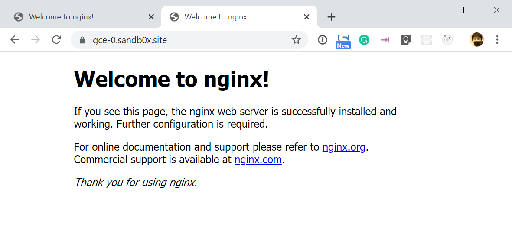

### MySQL

**Connect to Cloud SQL**

Check the connectivity in the TCP/IP layer to the Cloud SQL instance you created from your step server and app servers.

```shellsession
nc -zv $CLOUD_SQL_INSTANCE_IPADDR 3306
```

Get the SSL/TLS certificate to connect your Cloud SQL instance.

```shellsession
gcloud sql ssl client-certs create default client-key.pem --instance=$CLOUD_SQL_INSTANCE_NAME
gcloud sql ssl client-certs describe default --instance=$CLOUD_SQL_INSTANCE_NAME --format="value(cert)" > client-cert.pem
gcloud sql instances describe $CLOUD_SQL_INSTANCE_NAME --format="value(serverCaCert.cert)" > server-ca.pem
```

Install MySQL client tools.

```shellsession
sudo apt update
sudo apt install --no-install-recommends mysql-client
```

Connect to your Cloud SQL instance via `mysql` command.

```shellsession
mysql\
 --ssl-ca=server-ca.pem\
 --ssl-cert=client-cert.pem\
 --ssl-key=client-key.pem\
 --host=$CLOUD_SQL_INSTANCE_IPADDR\
 --user=root\
 --password
```

To get more information how to configure Cloud SQL SSL/TLS certificates, see [Configuring SSL/TLS certificates](https://cloud.google.com/sql/docs/mysql/configure-ssl-instance)

### Redis

**Connect to Memorystore for Redis**

Check the connectivity in the TCP/IP layer to the Memorystore for Redis instance you created from your step server and app servers.

```shellsession
nc -zv $MEMORYSTORE_INSTANCE_IPADDR 6379
```

Install Redis client tools.

```shellsession
sudo apt update
sudo apt install --no-install-recommends redis-tools
```

Connect to your Memorystore for Redis instance via `redis-cli` command.

```shellsession
redis-cli -h $MEMORYSTORE_INSTANCE_IPADDR INFO
```

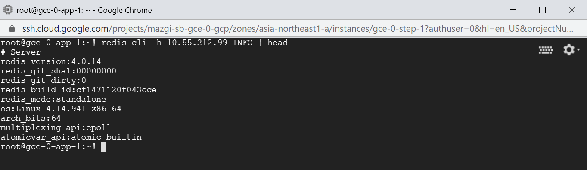
